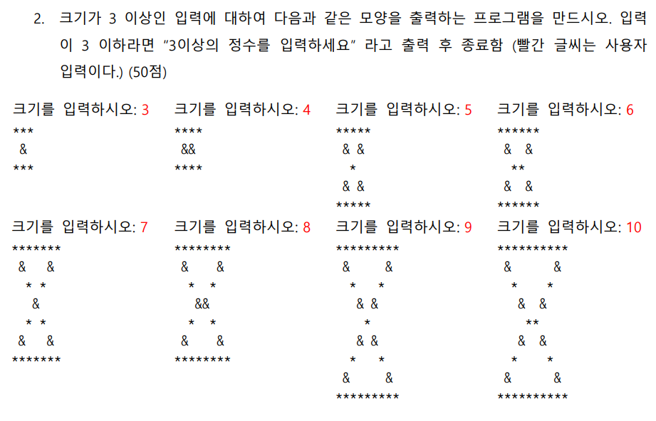

# C lang assignment

## 문제 :



### 이번 문제에서는 문제의 풀이핵심은 [처음, 중간, 끝] 그리고 [처음과 중간] [중간과 끝]으로 나누어 코드작성을 진행하는거였다. 조금 더 쉽게 코드를 작성할 수도 있을거 같지만 그래도 풀이과정에서 공부한 내용을 정리해보겠다.

- 정수가 아닌 문자가 입력될 때 다음과 같이 예외처리를 진행할 수 있습니다. scanf 형식에 "%d"로 인자를 받기 때문에 정수형태가 아닌 값이 입력된다면 반환 값으로 1이 아닌 숫자가 반환되게 됩니다. 그렇기에 1이 아닌 값이 반환될 시 정수가 아닌 값이 입력되었다는 것이고 다음과 같이 getchar()함수를 사용해서 버퍼를 비우고 새로운 입력을 받도록 작성할 수 있습니다.

```c
while (scanf("%d", &height) != 1) { // 크기입력, 문자입력 예외처리
			// 잘못된 입력 메시지출력
			printf("잘못된 입력입니다. 정수가 아닙니다.\n");

			while (getchar() != '\n'); //버퍼 지우기

			printf("크기를 입력하세요:");
		}
```

- 중간 입력을 따로 처리하여 다음과 같이 변수 하나를 생성하고 처리해주는 과정이 필요했다.

```c
// 중간 출력이 *인지, & 인지 알려주는 변수
		int center = (height + 1) / 2;
```

- 이후 입력 값을 짝수 홀수로 나누어 다음과 같이 코드를 작성해볼 수 있었다.


```c
#include<stdio.h>

int main() {

	int height;

	while (1) {
		printf("크기를 입력하시오: "); //크기 입력

		while (scanf("%d", &height) != 1) { // 크기입력, 문자입력 예외처리
			// 잘못된 입력 메시지출력
			printf("잘못된 입력입니다. 정수가 아닙니다.\n");

			while (getchar() != '\n'); //버퍼 지우기

			printf("크기를 입력하세요:");
		}

		if (height < 3) {
			printf("3이상의 정수를 입력하세요.\n");
			break;
		}
        
		int odd = 1; //초기 홀 수값 입력


		if (height % 2 == 0) { //짝수인 경우 높히를 맞춘다.
			height = height - 1;
			odd = 0;
		}

		// 중간 출력이 *인지, & 인지 알려주는 변수
		int center = (height + 1) / 2;

		// 홀수인 경우
		if (odd == 1)
		{
			for (int i = 1; i <= height; i++) {

				if (i == 1 || i == height) { // 첫째줄 마지막 줄 출력
					for (int j = 1; j <= height; j++) {
						printf("*");
						if (j == height) {
							//printf("\n");
						}
					}

				}
				else if (1 < i && i < (height / 2 + 1)) //두번째 줄부터 가운데 줄 전까지의 출력 
				{
					if (i % 2 == 0) { //짝수 Layer 
						for (int j = 1; j <= height; j++) {
							if (j == i || j == height - i + 1) {
								printf("&");
							}
							else {
								printf(" ");
							}
						}
					}
					else { // 홀수 Layer
						for (int k = 1; k <= height; k++) {
							if (k == i || k == height - i + 1) {
								printf("*");
							}
							else {
								printf(" ");
							}
						}
					}
				}
				// 중간 & 출력
				else if (i == (height / 2 + 1)) {
					for (int i = 0; i < height / 2; i++)
						printf(" ");
					if (center % 2 == 0)
						printf("&");
					else
						printf("*");
				}

				else { // 두번째 줄부터 마지막 줄 전까지의 출력
					if (i % 2 == 0) { //짝수 Layer 
						for (int j = 1; j <= height; j++) {
							if (j == i || j == height - i + 1) {
								printf("&");
							}
							else {
								printf(" ");
							}
						}
					}
					else { // 홀수 Layer
						for (int k = 1; k <= height; k++) {
							if (k == i || k == height - i + 1) {
								printf("*");
							}
							else {
								printf(" ");
							}
						}
					}

				}
				printf("\n");

			}

		}
		// 짝수인 경우
		else {

			for (int i = 1; i <= height; i++) { //첫번째 줄 마지막 줄 출력
				if (i == 1 || i == height) {
					for (int j = 1; j <= height + 1; j++)
						printf("*");
				}
				else if (1 < i && i < (height / 2 + 1)) // 두번째 줄 부터 가운데 줄 전까지의 출력
				{
					if (i % 2 == 0) { //짝수 Layer 
						for (int j = 1; j <= height + 1; j++) {
							if (j == i || j == height + 2 - i) {
								printf("&");
							}
							else {
								printf(" ");
							}
						}
					}
					else { // 홀수 Layer
						for (int k = 1; k <= height + 1; k++) {
							if (k == i || k == height + 2 - i) {
								printf("*");
							}
							else {
								printf(" ");
							}
						}
					}
				}
				// 중간 출력
				else if (i == (height / 2 + 1)) {
					// 띄어쓰기
					for (int i = 0; i < (height + 1) / 2 - 1; i++)
						printf(" ");
					if (center % 2 == 0)
						printf("&&");
					else
						printf("**");
				}
				else { //가운데 줄 부터 마지막 줄 전까지의 출력
					if (i % 2 == 0) { //짝수 Layer 
						for (int j = 1; j <= height + 1; j++) {
							if (j == i + 1 || j == height + 1 - i) {
								printf("&");
							}
							else {
								printf(" ");
							}
						}
					}
					else { // 홀수 Layer
						for (int k = 1; k <= height + 1; k++) {
							if (k == i + 1 || k == height + 1 - i) {
								printf("*");
							}
							else {
								printf(" ");
							}
						}
					}

				}
				printf("\n");
			}
		}

	}
	return 0;
}
```

